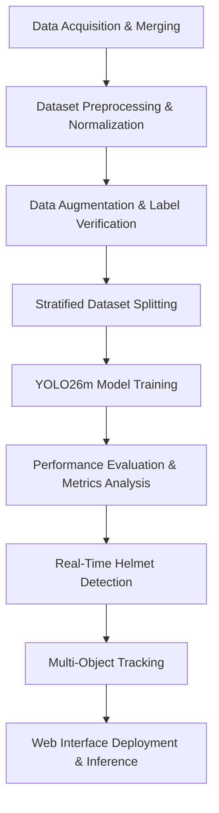
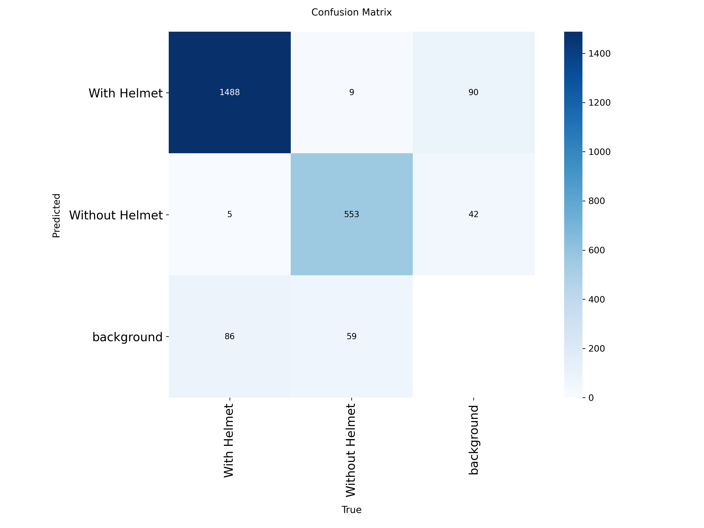
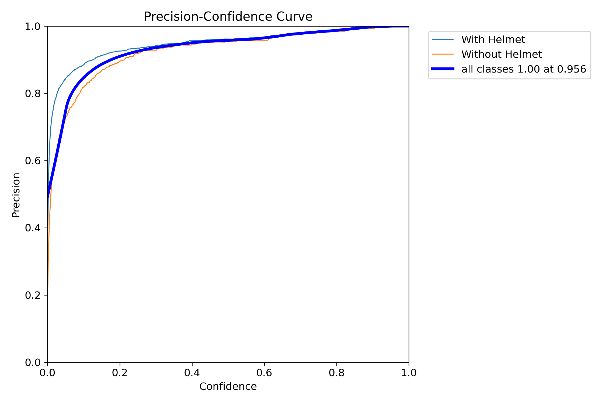
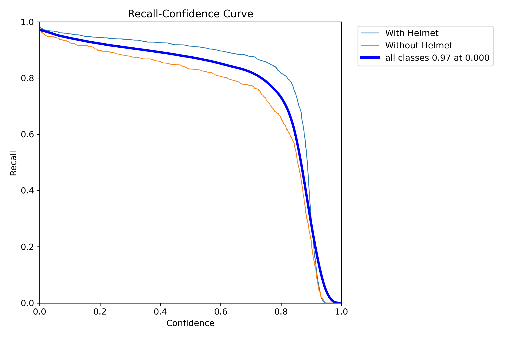
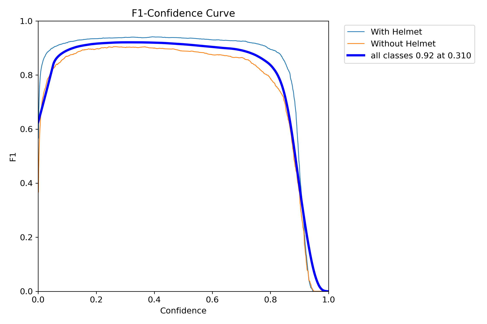
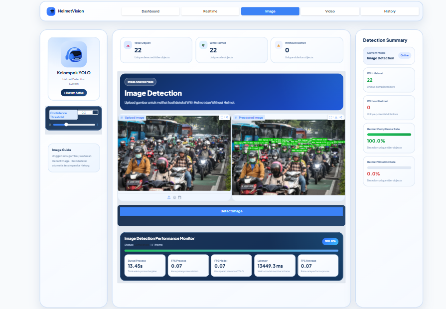

# Deteksi Penggunaan Helm pada Pengendara Menggunakan YOLO26m pada Sistem Multimedia Interaktif Berbasis Web

## Deskripsi Project
Sistem deteksi helm pada pengendara sepeda motor berbasis deep learning menggunakan YOLO26m untuk melakukanobject detection, object tracking, dan inference melalui aplikasi web interaktif.

.png)

## Gambaran Umum
Project ini mengembangkan sistem berbasis computer vision untuk mendeteksi penggunaan helm pada pengendara sepeda motor secara otomatis. Sistem mengklasifikasikan pengendara yang terdeteksi ke dalam dua kelas, yaitu `With Helmet` dan `Without Helmet`.

Model deteksi yang digunakan adalah YOLO26m, yang dilatih menggunakan dataset gabungan (gambar pengendara dari Indonesia dan luar negeri) yang bersumber dari platform Roboflow. Project ini mencakup tahapan pengembangan deep learning secara menyeluruh, mulai dari persiapan dataset, pelatihan model, evaluasi model, object detection, object tracking, hingga deployment melalui aplikasi web berbasis Gradio.

## Tujuan
1. Mengembangkan model deep learning untuk mendeteksi penggunaan helm pada pengendara sepeda motor.
2. Mengklasifikasikan pengendara ke dalam kelas `With Helmet` dan `Without Helmet`.
3. Mengevaluasi performa model YOLO26m menggunakan beberapa metrik evaluasi.
4. Menerapkan object tracking untuk mempertahankan identitas objek yang terdeteksi pada video.
5. Melakukan deployment model melalui aplikasi web interaktif berbasis Gradio.

## Dataset
Dataset dalam project ini disusun dengan menggabungkan dua dataset deteksi helm pengendara sepeda motor (lokal dan internasional) yang bersumber dari platform Roboflow.

Dataset akhir terdiri dari **5.491 gambar** dengan **18.519 instance objek beranotasi** yang terbagi ke dalam dua kelas.

| Kelas | Jumlah Instance |
|---|---:|
| With Helmet | 13.072 |
| Without Helmet | 5.447 |
| **Total** | **18.519** |

Dataset dibagi menjadi data training, validation, dan testing dengan rasio 80:10:10.

| Pembagian Dataset | Rasio |
|---|---:|
| Training | 80% |
| Validation | 10% |
| Testing | 10% |

## Metodologi
Tahapan pengembangan sistem terdiri dari beberapa proses berikut:

## Model
Model yang digunakan dalam project ini adalah YOLO26m, model object detection terbaru dari Ultralytics (rilis 2025). Varian medium ini dipilih karena menawarkan keseimbangan optimal antara kecepatan proses dan akurasi deteksi secara real-time.

## Konfigurasi Pelatihan
| Parameter | Nilai  |
| :--- | :--- |
| Model | YOLO26m |
| Ukuran Gambar | 640x640 |
| Epoch | 70 |
| Optimizer | MuSGD |
| Perangkat Pelatihan | NVIDIA Tesla T4 |
| Jumlah Kelas | 2 |

Model dilatih untuk mendeteksi dua kelas berikut:
- `With Helmet`
- `Without Helmet`

Pelatihan dilakukan menggunakan GPU NVIDIA Tesla T4. Proses pelatihan mencapai 70 epoch karena keterbatasan runtime komputasi yang tersedia.

## Object Tracking
Object tracking diterapkan menggunakan `SimpleIoUCentroidTracker` yang dikembangkan untuk mempertahankan identitas objek yang terdeteksi pada frame video secara berurutan.

Tracker menghubungkan objek pada frame yang berbeda berdasarkan nilai Intersection over Union (IoU) dan jarak centroid objek.

| Konfigurasi Tracking | Nilai  |
| :--- | :--- |
| IoU Treshold | 0.31 |
| Distance Treshold | 50 Piksel |
| Max Age | 30 Frame |

Komponen tracking digunakan untuk mempertahankan identitas objek pada frame video secara berurutan dan melengkapi proses deteksi helm.

## Performa Model
Model YOLO26m yang telah dilatih dievaluasi menggunakan beberapa metrik object detection.
| Metrik | Hasil  |
| :--- | :--- |
| mAP@0.5 | 95,6% |
| mAP@0.5:0.95 | 64,2% |
| Kecepatan Inference | 12,9 ms/gambar |
| Rata-rata FPS | 5,63 |

## Hasil Training
### Confusion Matrix

### Precision-Recall Curve

### F1 Curve

## Hasil Deteksi
| Input | Hasil Prediksi |
|-------|------------|
| .png)| .png) |
| .png) | .png) |

Hasil deteksi menampilkan bounding box, kelas objek yang terdeteksi, dan confidence score yang dihasilkan oleh model.

## Gradio App
Model yang telah dilatih kemudian diimplementasikan ke dalam aplikasi web menggunakan Gradio untuk menyediakan antarmuka inference yang interaktif.

Mendukung beberapa jenis input:
- Image
- Video
- Webcam

 ## Tech Stack
- Python
- PyTorch
- Ultralytics
- YOLO26mOpenCV
- NumPy
- Pandas
- Gradio
